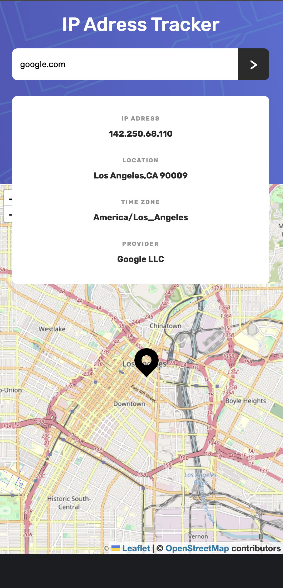

# Frontend Mentor - IP address tracker solution

This is a solution to the [IP address tracker challenge on Frontend Mentor](https://www.frontendmentor.io/challenges/ip-address-tracker-I8-0yYAH0). Frontend Mentor challenges help you improve your coding skills by building realistic projects. 

## Table of contents

- [Overview](#overview)
  - [The challenge](#the-challenge)
  - [Screenshot](#screenshot)
  - [Links](#links)
- [My process](#my-process)
  - [Built with](#built-with)
  - [What I learned](#what-i-learned)
  - [Continued development](#continued-development)

## Overview

### The challenge

Users should be able to:

- View the optimal layout for each page depending on their device's screen size
- See their location on the map on the initial page load
- Search for any IP addresses or domains and see the key information and location

### Screenshot




### Links

- Solution URL: [Frontend Mentor Solution link](https://github.com/jae-the-castaway/ip-tracker)
- Live Site URL: [Netlify link](https://jae-the-castaway-ip-tracker.netlify.app)
## My process

### Built with

- Semantic HTML5 markup
- CSS custom properties
- Flexbox
- Mobile-first workflow
- [IP API](https://ip-api.com) - IP Geolocation API
- [React Leaflet](https://react-leaflet.js.org) - React components for Leaflet maps
- [Leaflet](https://leafletjs.com) - open-source JavaScript library
for mobile-friendly interactive maps
- [React](https://reactjs.org/) - JS library
- [Vite](https://nextjs.org/) - React framework
- [Styled Components](https://styled-components.com/) - For styles

### What I learned

  I started this project to get familiar with `Styled Components` and `React`. I learned a lot while using `react-leaflet` for map data and `IP API` for fetching IP Geolocation API. It was a bit tough without having a proficiency in React and Styled Components.
```javascript
// ./src/App.jsx
  const fetchData = async (adress) => {
    try {
      setLoading(true);
      const response = await fetch(`http://ip-api.com/json/${adress?adress:""}`);
      const data = await response.json();
      setUser(data);
      setLoading(false);
      if ( data.status === 'success') {setCenter([data.lat, data.lon])}
    } catch (err) { console.log('Error occured when fetching data');}}

  useEffect(() => { fetchData();},[]);
```
&ensp;there are many ways to fetch api data on React. I chose `try{}catch{}`and `async, await`because it didn't require importing extra components or library from outside and this project was simple enough to use
<br>&ensp;on first load, with `useState`, set loading state to render loading bar on screen
<br>&ensp;also it has a fallback for error when fetching data

### Continued development
- can i move the zoom button on another corner? if possible, I could put that button bottom-left
- on Netlify, you can't use `http` and unluckily enough, for free IP-API pricing, I can't use `https` feature. I could either find another IP geolocation API with `https` option or find another hosting website that support `http`. but in my opinion, using `http` is unsafe anyway
